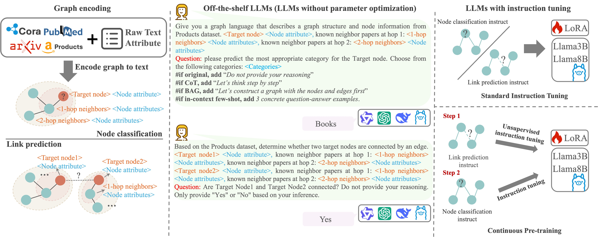

# Exploring Graph Tasks with LLMs: A Comprehensive Benchmark and Investigation


## 1. Environment Setup and Huggingface/Qwen/Deepseek/OpenAI API key


Before you begin, please make sure that you have Anaconda or Miniconda installed on your system. This guide assumes that you have a CUDA-enabled GPU.

```shell
# Create and activate a new Conda environment named 'LLM-benchmarking'
conda create -n LLM-benchmarking
conda activate LLM-benchmarking

# If your use a different CUDA version, please refer to the PyTorch and DGL websites for the appropriate versions.
conda install numpy
conda install pytorch==2.0.1 pytorch-cuda=12.2 -c pytorch -c nvidia

# Install additional dependencies
pip install torch_geometric pandas torchmetrics Deprecated 
```
Other required packages include `openai`, `Huggingface`, `ogb` etc, detail configuration can be found in `requirements.txt`.

> You need to set up your Huggingface/Qwen/Deepseek/OpenAI API key in suitable places. We will remind you in the code.

## 2. Unified Datasets and Raw Text

### Datasets
| **Dataset**       | **Domain**     | **Task**     | **\#Graph** | **\#Node**   | **\#Edge**     | **\#Classes** | **Metrics** | **Default feature** |
|-------------------|----------------|--------------|-------------|--------------|----------------|---------------|-------------|-------------|
| Cora              | citation       | Node, Link   | 1           | 2,708        | 5,429          | 7             | Accuracy   | Bag-of-Words |
| Pubmed            | citation       | Node, Link   | 1           | 19,717       | 44,338         | 3             | Accuracy   | TF-IDF      |
| OGBN-Arxiv        | citation       | Node, Link   | 1           | 169,343      | 1,166,243      | 40            | Accuracy   | Skip-gram   |
| OGBN-Products     | e-commerce     | Node, Link   | 1           | 2,449,029    | 61,859,140     | 47            | Accuracy   | Bag-of-Words |


### Download Datasets and Raw Text

- **Cora** and **PubMed**: You can download these datasets from [here](https://github.com/XiaoxinHe/TAPE). After downloading, place the datasets in the following directories:
  - `/dataset/cora/` for the Cora dataset
  - `/dataset/pubmed/` for the PubMed dataset

- **OGBN-Arxiv** and **OGBN-Product**: 
  - For **OGBN-Arxiv** and **OGBN-Product**, the dataset will be automatically downloaded when you run the dataloader. However, you will need to manually download the raw text files:
    - For **OGBN-Arxiv**, download the file from [this link](https://snap.stanford.edu/ogb/data/misc/ogbn_arxiv/titleabs.tsv.gz) and place it in `/dataset/ogbn_arxiv/titleabs.tsv`.
    - For **OGBN-Product**, download the folder from [this Google Drive link](https://drive.google.com/file/d/1gsabsx8KR2N9jJz16jTcA0QASXsNuKnN/view?usp=sharing) and place it in `/dataset/ogbn-products/Amazon-3M.raw`.


### Preprocess Datasets

We provide a function `get_data_and_text` to load and preprocess the datasets, and save them as `.pt` and `.pkl` files in the `dataset` folder.

```python
def get_data_and_text(dataset_name, train_perc=0.6, val_perc=0.2, test_perc=0.2, use_text=True, seed=42):
    # file path
    data_path = f"dataset/{dataset_name}_data.pt"
    text_path = f"dataset/{dataset_name}_text.pkl"

    # check if the files exist
    if os.path.exists(data_path) and os.path.exists(text_path):
        print("Load data and text files...")

        # load data and text
        data = torch.load(data_path)
        with open(text_path, "rb") as f:
            text = pickle.load(f)
    else:
        print("generate data and text files...")
        # regenerate data and text
        data, text = load_data(dataset_name, train_perc, val_perc, test_perc, use_text, seed)

        # save data and text
        torch.save(data, data_path)
        with open(text_path, "wb") as f:
            pickle.dump(text, f)
        print("data and text files saved!")

    return data, text
```

## 3. Baseline models
In this paper, we evaluate multiple baseline models and provide detailed descriptions of their implementations as follows. These models were applied to a consistently preprocessed version of the datasets to ensure fair comparisons and produce the experimental results presented in this study.

1. **GNNs**: For GCN, GraphSAGE, GAT, and Mixhop, we follow the models on [OGB Leaderboards](https://ogb.stanford.edu/docs/leader_nodeprop/). Specifically, the three models are all from [Luo et al. (2024)](https://github.com/LUOyk1999/tunedGNN), and the codes can be obtained from [here](https://github.com/LUOyk1999/tunedGNN).

2. **Graph SSL Models**: We choose GraphCL and GraphMAE in this category. For GraphCL, we follow the implementation from [this repository](https://github.com/Shen-Lab/GraphCL). For GraphMAE, we follow the implementation from [this repository](https://github.com/THUDM/GraphMAE).

3. **Graph Transformers**: We use Graphormer in this category. The implementation is from [this repository](https://github.com/microsoft/Graphormer).

4. **Foundational Graph Prompt Models**: We use Prodigy, OFA, All in one, GPF-plus, GraphPrompt, and ZeroG in this category. Prodigy’s and OFA’s implementations can be obtained from [here](https://github.com/snap-stanford/prodigy) and [here](https://github.com/LechengKong/OneForAll), respectively. For All in one, GPF-plus, and GraphPrompt, we use the implementation from ProG [Zhi et al. (2024)](https://github.com/sheldonresearch/ProG). For ZeroG, we follow the implementation from [this repository](https://github.com/NineAbyss/ZeroG).

5. **LM-Augmented Graph Learning Models**: For GIANT and TAPE, we follow the implementation from [this repository](https://github.com/NineAbyss/GLBench).

6. **LLM with Graph Projectors**: LLaGA is chosen for this category. The implementation is from [this repository](https://github.com/VITA-Group/LLaGA).

We provide some baseline models in `baseline` folder. The `baseline/output_model` provides some pretrained models.

## 4. Quick Start
The Architecture of LLM benchmarking is shown as follows:


### Graph encoding 
We combine the original graph datasets with their corresponding raw text attributes to encode the graph into a format that LLMs can understand, i.e., prompts. The prompt formats required for node classification and link prediction differ based on the specific task.

```shell
cd generate

# generate node classification prompts
python run_generate_node.py

# generate link prediction prompts
python run_generate_link.py
```
> Note: The prompts are generated based on the original graph datasets and their corresponding raw text attributes.
> The generated prompts are stored in the `output` folder. We put some examples for `Cora`


### LLMs instruction tuning
We use the generated prompts to train the LLMs to perform node classification and link prediction tasks.

We provide some .sh files in `lora-sft` folder. The configuration of the training process can be adjusted according to your needs. Make sure you have `deepspeed` installed.
For example, when you want to instruction tune the Llama3B model for node classification for the OGBN-Arxiv dataset, you can run the following command:
```shell
bash lora_sft/train_llama_3B_Instruct_arxiv_node.sh
```
The tuned LoRA weights will be stored in the `output_model` folder.


### LLMs inference

We provide LLMs inference codes in `LLM` folder.

For Qwen/GPT-4o/Deepseek, you have to provide your API key in the corresponding files.

For Llama, you can run the following command (just for example, you can adjust the args according to your needs):
```shell
#Node classification
python Llama_Instruct_node.py --dataset_name cora --model_size 3B --scenario full fine-tune --mode neighbors --hop "1 hop" --huggingface_token your_huggingface_token

#Link prediction
python Llama_Instruct_link.py --dataset_name arxiv --model_size 3B --scenario "2 formats" --case "1 hop" --huggingface_token your_huggingface_token
```
The results will be stored in the `results` folder.


